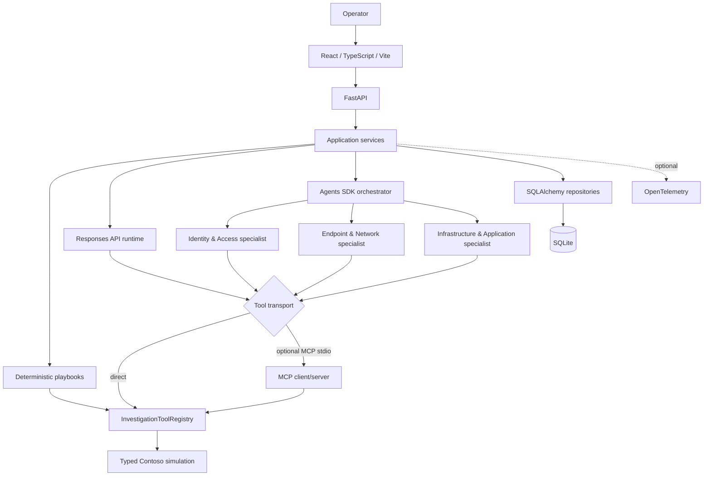

# 🛠️ Agentic SupportOps

**Governed IT incident investigation with deterministic and model-guided runtimes, auditable evidence, and human-controlled execution.**

[](https://github.com/cmosantos/agentic-supportops/actions/workflows/ci.yml)
[](https://github.com/cmosantos/agentic-supportops/tree/v1.0.1)
[](docs/publication-readiness.md)
[](apps/api/pyproject.toml)
[](apps/web)
[](LICENSE)

Agentic SupportOps is a **local-first engineering project** for controlled IT support investigations. It is not a general-purpose chatbot and it does not remediate real infrastructure. The unit of work is an incident, and the application—not the model—owns the investigation goal, plan, policies, evidence, approval gates and persisted operational history.

The project explores a practical question:

> How can an AI-assisted support system investigate incidents and recommend actions without giving the model unrestricted operational control?

## ✅ V1 status

**Agentic SupportOps v1.0.1 is complete and validated.**

Release baseline:

- **26** simulated incidents across identity, messaging, endpoint, network and infrastructure scenarios.
- **8** deeply supported deterministic playbooks.
- **20** provider-independent read-only SupportOps tools.
- **3** investigation runtimes: deterministic, OpenAI Responses API and OpenAI Agents SDK.
- **3** end-to-end Golden Journeys: `INC-023`, `INC-024`, `INC-026`.
- **310 backend tests** passed in the final full-suite baseline.
- **76 frontend tests** passed in the final full-suite baseline.
- TypeScript typecheck, Vite production build, MCP checks and dependency validation passed.
- Final browser validation completed with `INC-026 — User account locked`, including proposal, human approval, controlled execution, independent verification and explicit human resolution.

See [Publication readiness](docs/publication-readiness.md) and the [Changelog](CHANGELOG.md) for the release evidence.

## 🧭 Governed investigation lifecycle

```mermaid
flowchart LR
    Incident --> Goal[Investigation Goal]
    Goal --> Profile[Goal Profile]
    Profile --> Plan[Investigation Plan]
    Plan --> Runtime
    Runtime --> Evidence
    Evidence --> Findings
    Findings --> Proposal
    Proposal --> Approval[Human Approval]
    Approval --> Execution[Controlled Execution]
    Execution --> Verification[Independent Verification]
    Verification --> Resolution[Human Resolution]
```



The important boundary is intentional:

```text
AI diagnosis != approval != execution != verification != incident resolution
```

A model can investigate and recommend. It cannot silently rewrite the application-owned plan, automatically approve a mutation, execute arbitrary infrastructure actions, infer successful remediation from an execution acknowledgement, or close an incident by itself.

## 🏗️ Architecture



The frontend communicates only with FastAPI. MCP is an internal comparative transport for a small fixed read-only allowlist; it is not the product API.

For the detailed boundaries, transaction rules and recovery semantics, see [Architecture](docs/architecture.md).

## 🔍 What the system demonstrates

### Governed investigation input

Every goal-driven investigation can carry an application-owned contract containing:

- `Goal Profile`
- `Objective`
- `Success Criteria`
- `Constraints`
- `Human Approval Required`
- ordered `Investigation Plan`

Goal and Plan snapshots are persisted with the investigation run so the operator can later answer:

> What was this investigation trying to achieve, and what plan governed the runtime?

The runtime receives that same governed input instead of silently rebuilding a different plan.

### Run-scoped evidence and audit history

Successful tool observations are persisted as evidence owned by a stable `investigation_id`. Investigation steps and lifecycle events remain scoped to the same run, while historical runs stay available for later review.

The operator console separates:

- intended investigation plan;
- actual investigation activity;
- evidence;
- model findings;
- action proposal;
- human decision;
- physical execution attempt;
- verification evidence;
- final human resolution.

### Human-controlled remediation

Investigation tools are read-only. The three simulated mutation capabilities are isolated behind the execution boundary:

- `restart_simulated_service`
- `unlock_simulated_user`
- `reset_simulated_application_state`

A proposal must reference persisted investigation evidence. Human approval is required, and **approval does not execute anything automatically**. A separate operator action replays the exact persisted proposal through a bounded execution policy.

### Outcome certainty and safe recovery

The system distinguishes a known result from an unknown mutation outcome. If invocation may have started but the acknowledgement is unreliable, the mutation is **not automatically retried**.

Instead, the system supports:

```text
OUTCOME_UNKNOWN
    -> stale assessment
    -> explicit read-only reconciliation
    -> desired | undesired | inconclusive observation
```

This avoids pretending that distributed side effects are exactly-once when the real outcome is uncertain.

### Independent verification and human resolution

Execution success proves only that the approved action was acknowledged. Verification performs a **new governed read** of the relevant state.

```text
Execution COMPLETED != Verification VERIFIED != Incident RESOLVED
```

Even after a verified technical outcome, the incident remains open until a human explicitly chooses `RESOLVE` or `KEEP_OPEN`.

## 🤖 Investigation runtimes

| Runtime | Purpose | Tool access |
| --- | --- | --- |
| Deterministic | Reproducible rule-based investigation | Canonical registry |
| Responses API | Model-guided investigation | Direct registry or optional MCP allowlist |
| Agents SDK | Orchestrated specialist investigation | Specialist-bounded access through shared runtime context |

The Agents SDK path uses one orchestrator and three bounded diagnostic specialists while retaining application-owned governance and shared evidence ownership.

## 🔌 MCP boundary

Direct execution is the default:

```text
Agent runtime -> InvestigationToolRegistry -> capability
```

Optional MCP mode:

```text
Agent runtime -> MCP client -> stdio -> local MCP server
              -> InvestigationToolRegistry -> capability
```

The MCP server exposes only:

- `get_disk_usage`
- `check_dns_resolution`
- `get_application_health`

It cannot choose arbitrary commands, modules, files, credentials, databases or the complete application tool registry.

## 🧪 Golden Journeys

| Incident | Investigation | Controlled action | Independent verification |
| --- | --- | --- | --- |
| `INC-023` API health degraded | Application health and host context | Restart simulated service | Application health becomes healthy |
| `INC-024` Connection pool exhausted | Application, host, metrics and alerts | Reset simulated application state | Application state becomes healthy |
| `INC-026` User account locked | User and account state | Unlock simulated user | Account observer returns `locked=false` |

The final browser validation used `INC-026` and confirmed the complete human-governed lifecycle end to end.

## 🧰 Technology stack

| Layer | Technology |
| --- | --- |
| Frontend | React, TypeScript, Vite |
| Backend | FastAPI, Pydantic |
| Persistence | SQLAlchemy, SQLite |
| Model runtime | OpenAI Responses API |
| Agent runtime | OpenAI Agents SDK |
| Tool interoperability | MCP stdio, optional |
| Observability | Persisted domain events + optional OpenTelemetry |
| Python environment | uv |
| Testing | pytest, Vitest, React Testing Library |
| CI | GitHub Actions |

## 💻 Run locally

### Prerequisites

- Python 3.12
- [uv](https://docs.astral.sh/uv/)
- Node.js 24 with npm

Clone the repository and start from its root.

### Backend

Install the locked dependencies:

```powershell
uv sync --project .\apps\api --frozen --extra dev
```

Start FastAPI:

```powershell
uv run --project .\apps\api --frozen python -m uvicorn main:app --app-dir .\apps\api\src --reload
```

API: `http://localhost:8000`

OpenAPI: `http://localhost:8000/docs`

The first startup creates the local schema and seeds the Contoso fixture. Deterministic execution does not require an OpenAI credential.

For model-guided runtimes, copy the safe environment template and configure your own local key:

```powershell
Copy-Item .env.example .env.local
```

### Frontend

In another PowerShell:

```powershell
Set-Location .\apps\web
npm ci
npm run dev
```

UI: `http://localhost:5173`

### Reset local simulation data

> **Warning:** this intentionally drops local application tables and restores the fixture baseline. Back up any local history you want to keep first.

```powershell
$env:PYTHONPATH = ".\apps\api\src"
uv run --project .\apps\api --frozen python -m simulation.seed --reset
Remove-Item Env:PYTHONPATH
```

## 🧪 Validation commands

Backend:

```powershell
uv lock --project .\apps\api --check
uv pip check --python .\apps\api\.venv\Scripts\python.exe
uv run --project .\apps\api --frozen python -m pytest .\apps\api\tests
uv run --project .\apps\api --frozen python -m pytest .\apps\api\tests\test_mcp_integration.py
```

Frontend:

```powershell
Set-Location .\apps\web
npm run test:run
npm run typecheck
npm run build
Set-Location ..\..
```

The GitHub Actions workflow runs the release-relevant backend and frontend validation without requiring a production secret or external infrastructure.

## 🧭 Repository map

```text
agentic-supportops/
├── .github/workflows/ci.yml
├── apps/
│   ├── api/
│   │   ├── fixtures/
│   │   ├── prompts/
│   │   ├── src/
│   │   │   ├── api/
│   │   │   ├── db/
│   │   │   ├── domain/
│   │   │   ├── integrations/
│   │   │   ├── observability/
│   │   │   ├── repositories/
│   │   │   ├── services/
│   │   │   └── tools/
│   │   └── tests/
│   └── web/
├── data/
├── docs/
├── CHANGELOG.md
└── README.md
```

## 📚 Documentation

- [Architecture](docs/architecture.md) — service boundaries, lifecycle rules, persistence and recovery semantics.
- [Simulation](docs/simulation.md) — Contoso fixture, 26 incidents, 8 supported playbooks and tool catalog.
- [Operator console design](docs/operator-console-design.md) — UI responsibilities and human-control surfaces.
- [Publication readiness](docs/publication-readiness.md) — final V1 validation evidence.
- [Changelog](CHANGELOG.md) — release history for `v1.0.0` and `v1.0.1`.

## 🔐 Scope and safety

Agentic SupportOps is deliberately **simulation-only**.

- No real host, account, mailbox, cloud resource or service is modified.
- Investigation tools are read-only.
- Controlled mutations change only deterministic local simulation state.
- MCP exposes a fixed read-only subset of capabilities.
- No shell or arbitrary command execution is part of the agent tool surface.
- Human approval and human resolution are explicit application boundaries.
- Persisted events remain the operational audit source of truth; tracing is optional technical correlation.

## 🚧 Future evolution

The V1 is intentionally closed. Possible future work belongs to a separate V2/backlog and may include:

- authentication, authorization and multi-user tenancy;
- real ticketing or infrastructure integrations behind explicit policies;
- PostgreSQL and production database operations;
- hosted deployment and remote observability;
- stronger identity-backed approval workflows;
- broader MCP transport scenarios.

Those items are **not required for the completed V1**.

## 📄 License

Agentic SupportOps is available under the [MIT License](LICENSE).
