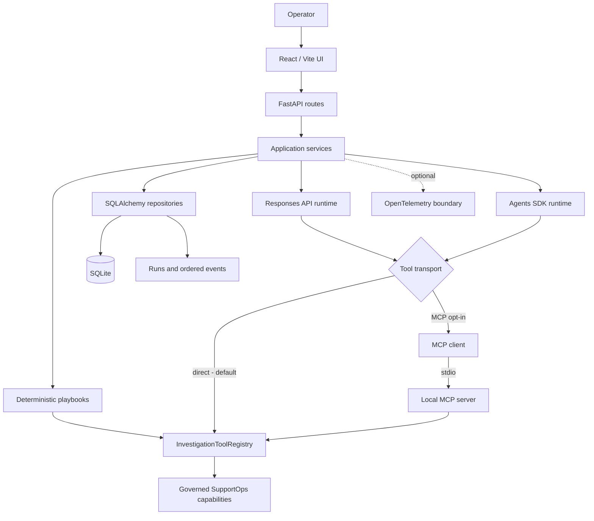

# 🛠️ Agentic SupportOps

[](https://github.com/cmosantos/agentic-supportops/actions/workflows/ci.yml)

Agentic SupportOps is a local-first engineering project for controlled IT support investigations. It explores how deterministic workflows and model-guided runtimes can investigate the same incident through governed, read-only capabilities while preserving an auditable execution history.

This is not a general-purpose chatbot. The unit of work is an incident. An investigation gathers factual evidence, and model-guided execution creates a run, records ordered lifecycle/tool events, and finishes with a structured result. Historical runs remain available while existing latest-state APIs stay compatible.

## ✅ What is implemented

- React/Vite operator UI for the fictional incident catalog and deterministic or Responses API investigations.
- FastAPI endpoints for incidents, investigations, evidence, latest state, run/event history, health, and AI configuration.
- Declarative playbooks backed by 20 provider-independent, read-only SupportOps tools.
- Optional OpenAI Responses API and comparative OpenAI Agents SDK runtimes.
- Canonical `InvestigationToolRegistry` for definitions, exact argument validation, execution, and normalized results.
- Direct execution by default and an opt-in local MCP stdio transport for three allowlisted capabilities.
- SQLAlchemy/SQLite persistence with append-oriented run/event history, concurrency protection, and atomic terminal persistence.
- Structured action proposals, durable human decisions, one approval-gated lab execution capability, and independent post-execution outcome verification.
- Optional application-owned OpenTelemetry spans; persisted events remain the domain source of truth.
- Isolated backend tests and CI gates for backend, MCP, TypeScript, and production builds.

No real infrastructure is queried. Investigation tools are read-only; the sole execution capability changes only the deterministic lab result and never touches a host process or service.

## 🎯 Engineering goals

- **Controlled execution:** the application validates tool names, schemas, call limits, and results.
- **Shared capability semantics:** all runtimes and transports reuse the same tool implementations.
- **Historical traceability:** new runs do not overwrite completed or failed run records.
- **Transactional integrity:** the required terminal event and terminal run state commit together.
- **Concurrency safety:** SQLite is the final guard against two `RUNNING` executions for the same incident/runtime.
- **Safe interoperability:** MCP exposes a fixed read-only allowlist, not the entire registry.
- **Observable execution:** domain events describe business execution; optional spans add technical correlation.
- **Reproducibility:** committed Python/Node lockfiles and CI use deterministic installation commands.

## 🏗️ Architecture



The frontend never talks to MCP directly; it calls FastAPI. MCP is an internal alternative transport between an agent runtime and selected existing tools. See [Architecture](docs/architecture.md) for responsibilities, lifecycle details, and transaction boundaries.

## 🔄 Investigation lifecycle

1. An operator selects an incident and a supported deterministic or model-guided investigation.
2. Deterministic execution resolves a playbook. Model-guided execution creates a persisted run for `manual_responses` or `agents_sdk`.
3. The runtime appends `run_started`, model-turn, and tool lifecycle events in sequence order.
4. Tool calls pass through the canonical registry, which validates exact names and string arguments before executing a read-only capability.
5. Successful tool observations become evidence with a stable ID and the owning `investigation_id`; every tool outcome becomes a similarly scoped investigation step.
6. The runtime gives persisted evidence IDs back to the model so later turns can correlate multiple observations. The final contract exposes the committed evidence references, hypothesis, confidence, missing information, recommended next steps, and human-control requirement.
7. A structured result completes the run, or a controlled failure marks it failed. Without useful evidence, the result becomes `insufficient_evidence` rather than presenting unsupported certainty. The terminal event and run transition share one transaction.
8. Latest endpoints keep compatibility; historical endpoints retrieve prior runs, event timelines, and run-scoped artifacts explicitly.

Models produce diagnoses, recommendations, and optional structured action proposals. The application validates proposal types, parameters, investigation ownership, and evidence references before a human may approve or reject. Approval never invokes an action automatically. For the sole executable action, a later operator request replays the exact persisted proposal through a separate execution allowlist and deterministic executor.

## 🔐 Controlled action execution

```text
AI Investigator -> Proposal -> Human Decision -> APPROVED only
               -> Execution Authorization -> Execution Policy
               -> Action Executor -> ToolRegistry capability
               -> Execution Result -> Persistence + Audit Events
```

Human approval does not give the AI unrestricted tool access. `restart_simulated_service`, `unlock_simulated_user`, and `reset_simulated_application_state` are registered for controlled execution but excluded from investigation schemas and the MCP allowlist. The execute endpoint accepts no capability, target, or argument body: those values come from the persisted proposal. All three mutations affect only the deterministic local Contoso simulation, and no model is called during execution.

SQLite enforces one `action_executions` row per proposal and one canonical physical attempt. The attempt records whether invocation started, its `failure_cause`, and its `outcome_certainty`. A known pre-mutation rejection is `NOT_APPLIED`; a timeout, acknowledgement loss, invalid result, or interruption after invocation is `UNKNOWN` and moves the execution to `OUTCOME_UNKNOWN`. Unknown mutation outcome is never automatically retried. The system reconciles by observing governed read-only state.

### Explicit recovery and reconciliation

```text
Proposal -> Human Approval -> Controlled Execution -> Physical Attempt
    known result -------------------------------------> normal completion
    unknown result -> OUTCOME_UNKNOWN -> Stale Assessment
                   -> Explicit Reconciliation -> read-only observation
                   -> desired | undesired | inconclusive
```

The canonical physical attempt is attempt #1. `invocation_started_at` separates interruption before invocation from interruption after mutation may have begun. `NOT_APPLIED` means there is sufficient evidence that mutation did not start. `UNKNOWN` means mutation may have occurred, so retry is unsafe. Stale assessment classifies interrupted attempts after the configured threshold; it never invokes the action.

Each attempt has at most one canonical reconciliation. The server derives its read-only observer, target, and expected state from policy. `DESIRED_STATE_OBSERVED` may complete the execution with `completion_basis=RECONCILIATION`; `UNDESIRED_STATE_OBSERVED` does not prove `NOT_APPLIED`; `INCONCLUSIVE` is not ordinary failure. The physical attempt remains historically `OUTCOME_UNKNOWN / UNKNOWN`: the attempt says, 'We do not know the original invocation result,' while reconciliation says, 'We can observe the desired state now.'

Recovery is explicit and only claims a canonical `RUNNING` reconciliation after `ACTION_EXECUTION_RECONCILIATION_STALE_AFTER_SECONDS`. A SQLite compare-and-set renews its lease before one new read-only observation. It creates neither an attempt nor another reconciliation. A crash before observation becomes recoverable after a later stale window; a crash after observation but before terminal persistence may cause a future recovery to observe again. This is safe because read retry is not mutation retry, and the application does not claim artificial exactly-once semantics.

`GET /action-executions/{execution_id}/attempts/{attempt_id}/reconciliation` returns persisted reconciliation state plus derived `is_stale`, `recoverable`, and typed `recovery_block_reason`. It never observes, recovers, renews a lease, creates events, or changes state. The GET is advisory; the explicit recovery POST always revalidates eligibility.

## 🔎 Post-execution outcome verification

Execution success proves that the approved action ran successfully. It does not prove that the incident condition was corrected. After a `COMPLETED` execution, the operator may request one canonical verification. The server derives the approved target from the persisted execution and proposal; the client supplies neither target nor observer.

```text
AI Investigator -> Proposal -> Human Approval -> Execution Policy
                -> Controlled Action -> Execution COMPLETED
                -> Verification Policy -> Read-only Observer
                -> Verification Evidence -> VERIFIED | NOT_VERIFIED | FAILED
```

`restart_simulated_service` and `reset_simulated_application_state` map server-side to the existing `get_application_health` observer with expected state `healthy`. `unlock_simulated_user` maps to `get_account_status` with expected `locked=false`. These are new reads after execution, never inferences from `execution.result`. `VERIFIED` means the expected state was observed, `NOT_VERIFIED` means a reliable observation did not satisfy it, and `FAILED` means no reliable observation could be collected. No AI/model, MCP loop, shell, subprocess, external monitoring, or real service or account management participates.

SQLite enforces one `outcome_verifications` row per execution. Requested/started events and the terminal verification state/event follow the existing transactional event pattern. Repeated requests return the canonical record without observing again. A verified outcome is human-visible evidence only: **`VERIFIED` does not automatically mean `INCIDENT RESOLVED`** and does not alter proposal, approval, execution, or incident history.

## 👤 Human resolution gate

```text
Execution COMPLETED != Verification VERIFIED != Incident RESOLVED
```

Execution proves that an approved action completed. Verification independently proves whether the expected technical outcome was observed. Resolution records a separate human operational decision that the incident may be closed.

```text
AI Investigator -> Proposal -> Human Approval -> Controlled Execution
                -> Independent Verification -> Verification Evidence
                -> Human Resolution Gate -> KEEP_OPEN
                                         -> RESOLVE -> Incident RESOLVED
```

The resolution API accepts only a persisted `verification_id`, `RESOLVE` or `KEEP_OPEN`, and an optional bounded reason. The server derives and validates the verification, execution, proposal, and incident ownership chain. `RESOLVE` requires `VERIFIED` evidence; `KEEP_OPEN` records a valid human review without changing incident status. A verified observation alone never changes the incident.

One canonical review is allowed per verification, and SQLite permits at most one effective `RESOLVE` record per incident. The decision, incident transition, and audit events commit atomically. No model, agent, MCP tool, remediation capability, shell, subprocess, or external service participates in resolution.

## 🔌 Direct and MCP execution

`TOOL_TRANSPORT=direct` is the default for Responses API and Agents SDK investigations:

```text
Agent runtime -> InvestigationToolRegistry -> existing capability
```

With `TOOL_TRANSPORT=mcp`, the runtime advertises only the MCP allowlist:

```text
Agent runtime -> MCP client -> stdio -> local MCP server
              -> InvestigationToolRegistry -> same capability
```

The official Python MCP SDK server exposes exactly:

- `get_disk_usage`
- `check_dns_resolution`
- `get_application_health`

The allowlist is fixed in code. The client launches `sys.executable -m integrations.mcp_server` without a shell, applies a bounded timeout, validates `ToolResult`, and closes resources after each call. MCP cannot select arbitrary commands/modules or access files, databases, credentials, or other registry tools.

MCP is not the product API: HTTP endpoints serve the UI and application clients, while MCP is an internal comparative tool transport.

## 🗄️ Persistence guarantees

- Runs are preserved as history; later runs do not replace earlier completed/failed records.
- Events are append-oriented and returned by deterministic `sequence` order.
- Only `RUNNING` records may transition; repeated terminal transitions are rejected.
- A partial unique SQLite index permits one `RUNNING` run per `(incident_id, runtime mode)` while retaining historical terminal runs.
- Database conflicts roll back before a structured HTTP `409` is returned.
- The terminal event is flushed without committing; the corresponding run transition commits both or rolls both back.
- Each proposal has at most one execution record; terminal execution state and terminal audit event commit together.
- Each execution has one canonical physical attempt number 1, and each attempt has at most one canonical reconciliation.
- Reconciliation terminal state, its audit event, and any execution completion via `RECONCILIATION` commit atomically.
- Each completed execution has at most one outcome verification; terminal verification state and event commit together.
- Each verification has at most one human resolution review; the final resolution decision, incident transition, and events commit together.
- Latest APIs retain existing semantics. History APIs list runs newest-first and expose events by stable `investigation_id`.
- Model-guided evidence and steps are linked to their `AIInvestigationRecord`; `/incidents/{incident}/investigation-runs/{investigation_id}/artifacts` resolves the exact evidence behind an older result.

SQLite evolution uses a small idempotent compatibility layer at startup; Alembic is not used. Tests cover fresh databases and legacy unique-constraint/index shapes using temporary storage.

## 🧭 Project structure

```text
agentic-supportops/
├── .github/workflows/ci.yml       backend and frontend validation
├── apps/api/
│   ├── fixtures/                  fictional Contoso data
│   ├── prompts/                   model-investigation instructions
│   ├── src/
│   │   ├── api/                   FastAPI routes and dependencies
│   │   ├── db/                    ORM, sessions, schema compatibility
│   │   ├── domain/                typed execution/API models
│   │   ├── integrations/          OpenAI, Agents SDK, MCP boundaries
│   │   ├── observability/         optional OpenTelemetry boundary
│   │   ├── repositories/          persistence and fixture access
│   │   ├── services/              orchestration and lifecycle rules
│   │   └── tools/                 read-only capabilities
│   ├── tests/                     backend and real MCP stdio tests
│   ├── pyproject.toml
│   └── uv.lock
├── apps/web/                      React, TypeScript, Vite UI
├── data/                          ignored SQLite data (`.gitkeep` only)
└── docs/                          architecture, simulation, readiness
```

## 💻 Local development

### Prerequisites

- Python 3.12
- [uv](https://docs.astral.sh/uv/)
- Node.js 24 with npm

Commands start from the repository root and are PowerShell-friendly.

### Backend

Install locked runtime and development dependencies:

```powershell
uv sync --project .\apps\api --frozen --extra dev
```

No variable is required for deterministic execution, imports, or tests. Defaults and optional settings are in [`.env.example`](.env.example). Create an ignored local override only when needed:

```powershell
Copy-Item .env.example .env.local
```

Leave `OPENAI_API_KEY` empty unless intentionally making real model calls. Direct tool transport remains the default.

Start from the repository root so the default relative database path resolves to `data/agentic_supportops.db`:

```powershell
uv run --project .\apps\api --frozen python -m uvicorn main:app --app-dir .\apps\api\src --reload
```

The API is at `http://localhost:8000`; OpenAPI is at `http://localhost:8000/docs`. First startup creates the schema, applies compatible legacy upgrades, and seeds 25 incidents. Normal startup preserves existing data.

Run the MCP server independently:

```powershell
$env:PYTHONPATH = ".\apps\api\src"
uv run --project .\apps\api --frozen python -m integrations.mcp_server
Remove-Item Env:PYTHONPATH
```

### Frontend

```powershell
Set-Location .\apps\web
npm ci
npm run dev
```

The UI is at `http://localhost:5173`. Use `apps/web/.env.local` with `VITE_API_BASE_URL` only when the API is elsewhere.

### Resetting local data

This command drops application tables and restores the fixture baseline. Back up needed local history first.

```powershell
$env:PYTHONPATH = ".\apps\api\src"
uv run --project .\apps\api --frozen python -m simulation.seed --reset
Remove-Item Env:PYTHONPATH
```

## 🧪 Testing

Backend tests cover HTTP contracts, services, tools, fake provider orchestration, lifecycle invariants, SQLite compatibility, tracing, and real MCP stdio parity.

```powershell
uv lock --project .\apps\api --check
uv pip check --python .\apps\api\.venv\Scripts\python.exe
uv run --project .\apps\api --frozen python -m pytest .\apps\api\tests
uv run --project .\apps\api --frozen python -m pytest .\apps\api\tests\test_mcp_integration.py
```

The focused frontend behavioral suite uses Vitest, React Testing Library, and jsdom. It exercises incident loading and selection, investigation success/failure states, AI/deterministic distinctions, and stale-response protection without a live backend or model call:

```powershell
Set-Location .\apps\web
npm run test:run
npm run typecheck
npm run build
Set-Location ..\..
```

## ⚙️ Continuous integration

The committed [GitHub Actions workflow](.github/workflows/ci.yml) targets pull requests and pushes to `master`:

- **Backend:** Python 3.12, uv lock check, frozen dev installation, dependency health, application import, the full pytest suite, and separately visible real MCP stdio parity.
- **Frontend:** Node.js 24, `npm ci`, focused behavioral tests, TypeScript, and Vite production build.

No OpenAI credential, external MCP server, persistent database, or production secret is required. The public repository is published on GitHub, and the workflow and underlying commands have been validated locally and successfully on a GitHub-hosted Ubuntu runner.

## 🔎 API discoverability

FastAPI exposes the complete interactive contract at `/docs`.

| Group | Representative endpoints |
| --- | --- |
| Health/config | `GET /health`, `GET /ai/config` |
| Incidents | `POST /incidents`, `GET /incidents`, `GET /incidents/{incident_id}` |
| Deterministic | `POST /incidents/{incident_id}/investigate`, `GET /incidents/{incident_id}/investigation` |
| Model-guided | `POST /incidents/{incident_id}/investigate-ai`, `POST /incidents/{incident_id}/investigate-agent-sdk` |
| Latest state | `GET /incidents/{incident_id}/ai-investigation`, `GET /incidents/{incident_id}/agent-sdk-investigation` |
| Latest event timeline | `GET /incidents/{incident_id}/investigations/{runtime}/events` |
| Run history | `GET /incidents/{incident_id}/investigation-runs?runtime=manual_responses` |
| Event history | `GET /incidents/{incident_id}/investigation-runs/{run_id}/events` |
| Controlled execution | `POST /incidents/{incident_id}/investigation-runs/{run_id}/action-proposals/{proposal_id}/execute` |
| Assess stale attempt | `POST /action-executions/{execution_id}/attempts/{attempt_id}/stale-assessment` |
| Reconcile unknown outcome | `POST /action-executions/{execution_id}/attempts/{attempt_id}/reconcile` |
| Recover stale reconciliation | `POST /action-executions/{execution_id}/attempts/{attempt_id}/reconciliation/recover` |
| Read reconciliation | `GET /action-executions/{execution_id}/attempts/{attempt_id}/reconciliation` |
| Verify completed execution | `POST /action-executions/{execution_id}/verify` |
| Read canonical verification | `GET /action-executions/{execution_id}/verification` |
| Record human resolution review | `POST /incidents/{incident_id}/resolution-decisions` |
| Read resolution history | `GET /incidents/{incident_id}/resolution-decisions` |

References such as `INC-014` and numeric IDs are accepted where `{incident_id}` appears.

```powershell
Invoke-RestMethod http://localhost:8000/health
Invoke-RestMethod http://localhost:8000/incidents
Invoke-RestMethod http://localhost:8000/incidents/INC-014/investigation-runs
```

## 📌 Current scope and future evolution

The project is currently a single-user local application over simulation data. It demonstrates controlled read-only investigation, optional model orchestration, MCP transport comparison, durable run/event history, local observability, and one approval-gated lab action. It does not remediate real systems.

Not yet included:

- authentication, authorization, or multi-user tenancy;
- authentication-backed human identity and real remediation tools;
- remote MCP, Streamable HTTP, OAuth, or persistent MCP pooling;
- PostgreSQL or production database operations;
- external ticketing/infrastructure integrations;
- hosted telemetry, deployment, or cloud infrastructure;
- frontend views for complete historical run/event APIs.

See [Publication readiness](docs/publication-readiness.md) for the verified publication and validation baseline.

## 📄 License

Agentic SupportOps is available under the [MIT License](LICENSE).
