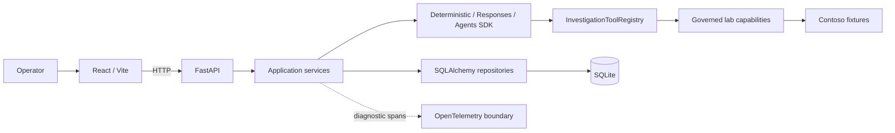
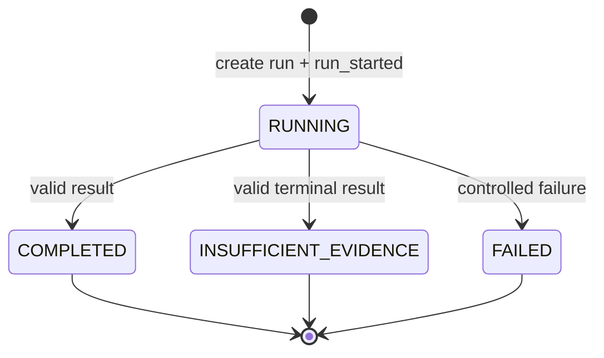
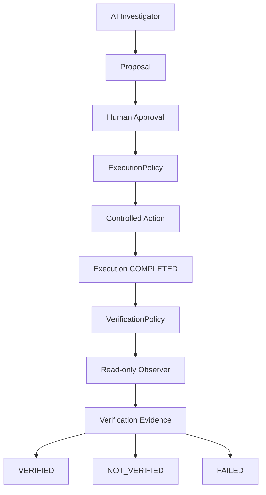

# Architecture

This document describes the implemented Agentic SupportOps runtime: component boundaries, execution paths, persistence, and observability.

## System context

Agentic SupportOps is local-first and operates over a fictional Contoso environment. React is the operator surface; FastAPI owns the product API and application lifecycle. Deterministic and model-guided investigations reuse the same read-only capabilities.



The UI launches deterministic and manual Responses API investigations. The Agents SDK runtime and historical run/event APIs are available through FastAPI but lack dedicated frontend screens.

## Component responsibilities

| Component | Responsibility |
| --- | --- |
| `apps/web` | Health, incident catalog, mode selection, execution requests, and evidence/result presentation. |
| `api/routes.py` | HTTP contracts, dependency injection, status translation, and runtime selection. |
| `services/` | Orchestration, loop limits, lifecycle rules, and event recording. |
| `integrations/` | Responses API, Agents SDK, and MCP infrastructure boundaries. |
| `InvestigationToolRegistry` | Canonical catalog, schemas, exact input validation, execution, and normalized `ToolResult`. |
| `tools/` | Deterministic investigation capabilities and one bounded lab action over fixture-backed state. |
| `repositories/` | Persistence queries, transaction ownership, history retrieval, and simulation access. |
| `db/` | SQLAlchemy records/session and idempotent SQLite compatibility. |
| `observability/` | Optional OpenTelemetry spans and safe resource attributes. |

## Execution paths

### Deterministic

The incident category selects a declarative playbook. Steps resolve arguments from incident context and execute directly through the registry. Before starting, the repository replaces the prior deterministic Evidence/Steps materialized view for that incident. Successful observations become evidence; every outcome becomes an investigation step.

Deterministic investigations do not create model-guided run records or model-turn events.

### Manual Responses API

The service creates a `RUNNING` record in mode `ai`, records `run_started`, and requests provider turns through `ResponsesGateway`. Function calls pass through the selected transport. Loop, total-call, repeated-call, timeout, and output limits remain application-owned. Tests use a fake gateway and make no OpenAI call.

### Agents SDK

The comparative service creates a `RUNNING` record in mode `agents_sdk`. Application-created `FunctionTool` adapters invoke `AgentsSDKRunContext`, which applies call limits, records events, dispatches through the selected registry/transport, and normalizes results. Agents SDK provider tracing remains disabled.

## Tool governance and MCP

The registry contains 20 investigation tools plus one execution-only lab capability with explicit schemas. Exact argument names and string values are validated. The execution-only capability is excluded from `names`, OpenAI schemas, and MCP discovery, so the model cannot select it. No capability can choose arbitrary processes, files, database queries, URLs, headers, or credentials.

```text
DIRECT: Runtime -> InvestigationToolRegistry -> capability

MCP:    Runtime -> MCP client -> stdio -> MCP server
                -> InvestigationToolRegistry -> same capability
```

MCP exposes only `get_disk_usage`, `check_dns_resolution`, and `get_application_health`. Thin handlers delegate to the canonical registry; business logic is not copied. The client uses the active Python executable, a fixed module, no shell, a bounded timeout, and per-call cleanup. MCP SDK types stay inside `integrations/`.

MCP adds a standards-based internal transport. It does not replace FastAPI, create a remote server, or bypass registry validation.

## Run and event lifecycle



Only `RUNNING` records may transition. A second terminal transition raises `InvalidInvestigationTransitionError`.

Events store `investigation_id`, runtime, type, and monotonically increasing sequence. Normal execution appends events; retrieval orders them by sequence. Metadata may include safe transport and trace correlation fields, not provider payloads, credentials, headers, or full evidence.

## Evidence-driven investigation

```text
incident -> agent -> tool policy -> approved direct/MCP capability
         -> persisted evidence -> model correlation -> bounded hypothesis
         -> operator recommendation
```

Evidence is a successful, normalized read-only `ToolResult` persisted by the application. Model output is an assessment of that evidence; it is not itself evidence. Each model-guided Evidence and InvestigationStep carries the owning `investigation_id`, and the final result exposes `evidence_ids` that resolve to those committed records. The application replaces any model-supplied identifiers with the IDs actually collected for that investigation. With no successful evidence, it records `insufficient_evidence`, caps confidence, removes unsupported evidence claims, and reports the missing information.

The model can choose only schemas exposed by the application registry. MCP discovery never expands that policy: the MCP transport has its own fixed subset, validates arguments before starting stdio, and normalizes the server response back to `ToolResult` before persistence.

The persisted plan is deliberately lightweight: ordered model/tool events show what category was checked without storing chain-of-thought, scratchpads, prompts, or private deliberation. Recommendations remain human-controlled; no tool can execute the proposed remediation.

## Human approval boundary

```text
investigation -> recommendation -> structured action proposal
              -> application policy validation -> PENDING
              -> human APPROVED or REJECTED
```

An action proposal is durable application data linked to the originating `AIInvestigationRecord` and its evidence IDs. The model may suggest only bounded data; the application registry authoritatively accepts `restart_simulated_service`, `unlock_simulated_user`, or `reset_simulated_application_state` with exact parameter shapes. Unknown actions, mismatched evidence, and ineligible investigations fail closed.

Proposal creation and decisions append `action_proposal_created`, `action_proposal_approved`, or `action_proposal_rejected` to the existing investigation event timeline. A decision state and its event share one database transaction. Approval records human intent only and never triggers execution automatically.

## Controlled execution boundary

```text
AI Investigator
      |
      v
   Proposal
      |
      v
Human Decision
      |
 APPROVED only
      v
Execution Authorization
      |
      v
Execution Policy
      |
      v
Action Executor
      |
      v
ToolRegistry Capability
      |
      v
Execution Result
      |
      v
Persistence + Audit Events
```

Human approval does not give the AI unrestricted tool access. It permits one attempt of one persisted proposal. `ExecutionPolicy` independently allows only `restart_simulated_service`; the endpoint accepts no replacement action data, and the executor combines the persisted proposal target with its persisted parameters. It does not call Responses API, Agents SDK, MCP, or any model to reinterpret the action.

The capability operates entirely over the local Contoso application abstraction. For a known application/service it returns a deterministic transition such as `degraded -> healthy`; an unknown target produces a controlled failure. It invokes no shell, subprocess, Windows service manager, Docker, operating-system API, filesystem write, or external HTTP request.

`action_executions.proposal_id` is unique. Creation in `RUNNING` state and the requested/started events commit together. Capability success or failure is recorded as `COMPLETED` or `FAILED`, and the matching terminal event commits in the same transaction. A repeated or concurrent request observes the existing row and cannot invoke the capability twice. Execution failure does not rewrite the historically separate `APPROVED` decision.

## Post-execution verification boundary

Successful execution is not proof of successful remediation. `ActionExecution(COMPLETED)` and `OutcomeVerification(VERIFIED)` are separate historical facts.



`POST /action-executions/{execution_id}/verify` accepts no verification command. The service loads the execution, its proposal, and the approved target from SQLite. `VerificationPolicy` maps the persisted `restart_simulated_service` capability to the canonical `get_application_health` read-only capability and expected `healthy` state. Neither client nor model selects the target, observer, or arguments.

The observer performs a new read of the simulated application state; it never trusts `execution.result.current_state`. A successful matching observation produces `VERIFIED`; a successful non-matching observation produces `NOT_VERIFIED`; an unavailable or failed observer produces `FAILED` with a bounded safe error. No Responses API, Agents SDK, model, MCP agent loop, shell, subprocess, or external system is called.

`outcome_verifications.execution_id` is unique. The initial record and requested/started events are committed together. Terminal state and its matching `verification_verified`, `verification_not_verified`, or `verification_failed` event share another transaction. Concurrent/repeated requests return the canonical record and never repeat observation.

Verification does not rewrite the proposal, human decision, execution, or incident. In particular, **`VERIFIED` does not automatically mean `INCIDENT RESOLVED`**; incident resolution remains a future human-governed boundary.

The three policies retain distinct trust contexts over one capability catalog:

| Policy | Authority |
| --- | --- |
| Investigation policy | Read-only capabilities an AI runtime may inspect. |
| Execution policy | Mutable capability an approved proposal may invoke once. |
| Verification policy | Deterministic read-only observer used to evaluate a completed execution. |

## Persistence and transactions

Run records are append-oriented history. Latest lookups order by descending run ID; history lists all runs newest-first. Historical events are explicitly run-scoped.

SQLite enforces:

```text
UNIQUE (incident_id, mode) WHERE status = 'RUNNING'
UNIQUE (action_executions.proposal_id)
UNIQUE (outcome_verifications.execution_id)
```

This permits one manual Responses run and one Agents SDK run for the same incident, while rejecting concurrency within one mode. `IntegrityError` handling rolls back the session before returning a controlled conflict.

Terminal consistency uses one transaction. The recorder adds `run_completed` or `run_failed` with `commit=False`; completion/failure updates the run and commits both. Commit failure rolls both changes back.

Evidence and InvestigationSteps are different from events but are now append-oriented for model-guided runs. New records carry the current `AIInvestigationRecord.id` as `investigation_id`; historical artifact retrieval filters by that stable relationship. Legacy rows remain readable with a null association, while deterministic evidence retains its existing incident/origin materialized-view behavior.

## SQLite compatibility

There is no migration framework. Before `Base.metadata.create_all`, `ensure_sqlite_schema_compatibility` performs an idempotent SQLite-only evolution:

- adds legacy Evidence/Step columns, nullable `investigation_id` associations, and indexes when absent;
- rebuilds legacy run tables with obsolete uniqueness;
- preserves run rows during reconstruction;
- creates the runtime-scoped partial unique index.

Tests validate fresh databases, legacy constraint/index forms, preservation, index recreation, and repeated startup using temporary SQLite files.

## Observability

Persisted events are the domain audit timeline. OpenTelemetry is an optional technical view around request, investigation, model, tool, and selected persistence boundaries.

Tracing is off by default. Supported local exporters are `none` and `console`; no collector is required. Safe resource identifiers may be attached to spans, while prompts, evidence payloads, credentials, response bodies, and headers are excluded.

## Operator control and limits

The operator chooses the incident and investigation mode. AI is unavailable in the UI without an OpenAI key. Selecting another incident aborts the browser request/view; it is not a server-side cancellation protocol.

There is currently no authentication, real-system remediation, remote MCP deployment, background queue, or multi-user control plane. Controlled execution is limited to one explicitly approved, deterministic lab action; approval by itself does not execute it.
